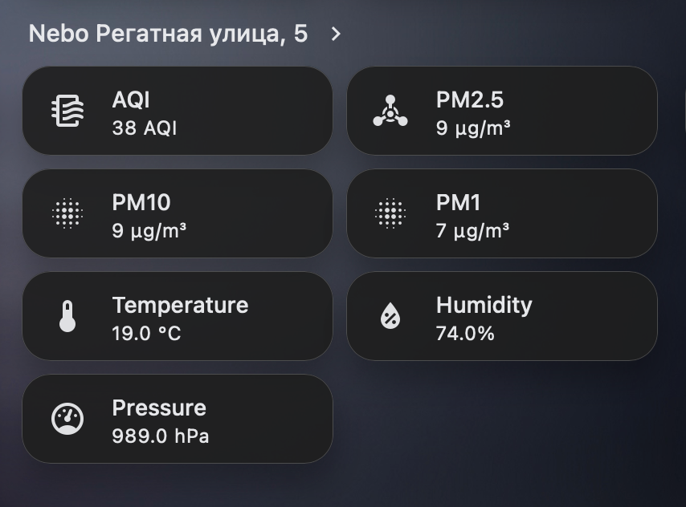

# Nebo.Live Integration 🍃

Home Assistant custom component that monitors air quality from [Nebo.Live](https://nebo.live) public sensors. No API key required — data is scraped from the public sensor page.



## Features

- **No API key** — scrapes the public sensor page
- **All metrics**: AQI, PM2.5, PM1, PM10, temperature, humidity, pressure
- **Multiple sensors** per city
- **Configurable scan interval** (default 10 min)
- **Device grouping** — all metrics from one sensor grouped under a single device

## Installation

### HACS (recommended)

1. Add this repo as a custom repository in HACS
2. Search for "Nebo.Live Air Quality" in integrations
3. Click **Download**
4. Restart Home Assistant

### Manual

```bash
cp -r custom_components/nebo_live /path/to/ha/config/custom_components/
# Restart HA
```

## Setup

1. **Settings → Devices & Services → Add Integration**
2. Find **Nebo.Live Air Quality**
3. Configure:
   - **City** — city slug (e.g., `krs` for Krasnoyarsk)
   - **Sensors** — sensor URL slugs (e.g., `regatnaya-ulitsa-5`) with names

City slug can be found in the city page URL: `nebo.live/en/{krs}/...`

## Entities

Each sensor creates the following entities:

| entity_id | Metric | Unit |
|-----------|--------|------|
| `sensor.nebo_{name}_aqi` | AQI | AQI |
| `sensor.nebo_{name}_pm25` | PM2.5 | µg/m³ |
| `sensor.nebo_{name}_pm01` | PM1 | µg/m³ |
| `sensor.nebo_{name}_pm10` | PM10 | µg/m³ |
| `sensor.nebo_{name}_temperature` | Temperature | °C |
| `sensor.nebo_{name}_humidity` | Humidity | % |
| `sensor.nebo_{name}_pressure` | Pressure | hPa |

## Known limitations

- Data updates are delayed — nebo.live itself doesn't update in real time
- The component parses HTML — site layout changes may break it (PRs welcome)
- Minimum recommended scan interval is 5 minutes

## License

See [LICENSE](LICENSE).
